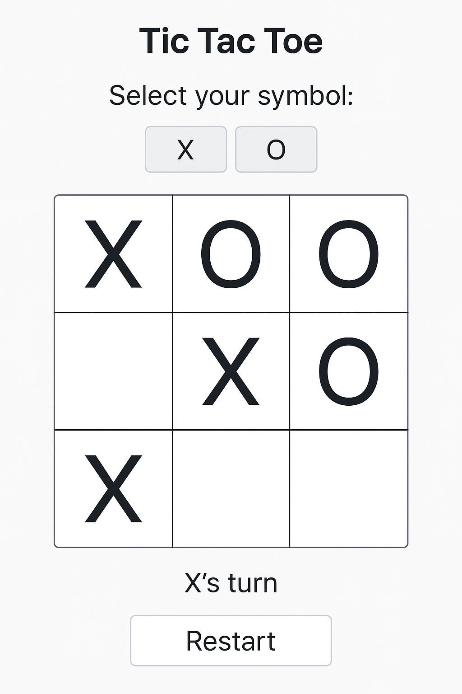

# 🧠 Human vs AI Tic-Tac-Toe Game

A simple, clean, and responsive **Tic-Tac-Toe web app** where a human can play against an **unbeatable AI** powered by the **Minimax algorithm**. Built using **HTML5**, **CSS3**, and **vanilla JavaScript**, and deployable on **Hugging Face Spaces**.

---

## 🎯 Features

- ✅ Human vs. AI gameplay
- ✅ Select your symbol: X or O
- ✅ Smart AI using Minimax (never loses)
- ✅ Responsive 3x3 grid for mobile, tablet, and desktop
- ✅ Simple, clean UI using only HTML/CSS/JS
- ✅ No dependencies or frameworks
- ✅ Easily deployable on Hugging Face Spaces

---

## 📸 Preview



> Note: Add an actual screenshot named `screenshot.png` for better presentation.

---

## 🛠️ Technologies Used

- **HTML5** – Structure of the game and UI
- **CSS3** – Styling and responsiveness
- **JavaScript (ES6)** – Game logic and AI (Minimax)
- **Hugging Face Spaces** – Hosting as a static web app

---

## 🚀 How to Run Locally

1. **Clone the repo**
   ```bash
   git clone https://github.com/your-username/human-vs-ai-tic-tac-toe.git
   cd human-vs-ai-tic-tac-toe
   ```

2. **Open `index.html` in your browser**
   ```bash
   open index.html
   ```

   Or just double-click the file in any file explorer.

---

## 💡 How to Play

1. Launch the app.
2. Choose your symbol: ❌ X or ⭕ O.
3. The game board will appear.
4. Take turns to play — AI will always play optimally.
5. Restart the game anytime using the **Restart** button.

---

## 🧠 How the AI Works

This game uses the **Minimax algorithm**, a recursive decision-making technique often used in two-player games to:
- Simulate every possible move
- Score the resulting game states
- Choose the optimal move that minimizes loss and maximizes win

In this game, the AI will either **win or force a draw**, but never **lose**.

---

## 🌐 Deploying on Hugging Face Spaces

### Option 1: Upload Manually

1. Go to [https://huggingface.co/spaces](https://huggingface.co/spaces)
2. Create a **new space**
   - Space SDK: `Static HTML`
   - Repo name: `human-vs-ai-tic-tac-toe`
3. Upload the following files:
   - `index.html`
   - `style.css`
   - `script.js`
   - `README.md`

### Option 2: Deploy from GitHub

1. Push the project to a public GitHub repo
2. In Hugging Face Spaces, choose **"Import from GitHub"**
3. Select your repository
4. Set SDK to **Static HTML**

That's it! Your game will be live.

---

## 📁 Project Structure

```
tic-tac-toe/
├── index.html      # Main HTML file
├── style.css       # Styling and layout
├── script.js       # Game logic and AI
├── README.md       # Project documentation
└── screenshot.png  # (Optional) UI preview
```

---

## ✨ Future Improvements

- Add win animations
- Add sound effects
- Keep game score history
- Add difficulty levels (easy, hard)
- Convert to a PWA for offline play

---

## 🙋‍♂️ Author

**Suyog Suresh Joshi**  
20+ years of experience in software development, now building educational and AI-based tools for the web.

---

## 📄 License

This project is licensed under the [MIT License](LICENSE).

---

## 🤝 Contributing

Feel free to fork this repo and submit pull requests. For any issues or suggestions, create a GitHub issue.

---

Enjoy the game! 🎮
